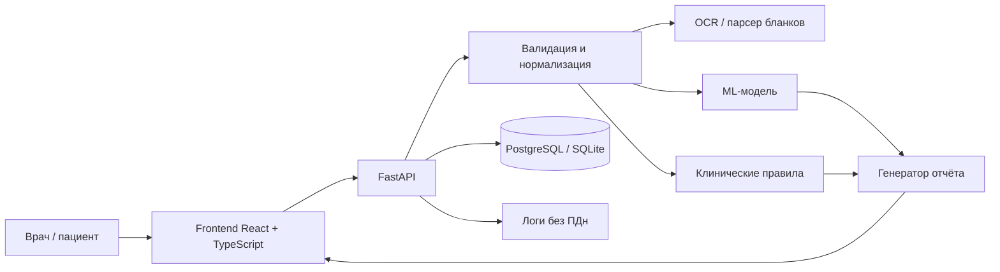

# Meditron_2026_Case_3
 Meditron — веб-сервис ИИ-скрининга латентных дефицитных состояний и анемий

> Прототип для кейса Сеченовского университета.  
> Сервис предназначен для поддержки врача, не является медицинским изделием и не заменяет клиническое решение специалиста.

## 1. Цели и задачи

### Цель
Создать воспроизводимый программный прототип веб-сервиса на базе машинного обучения для автоматизированной интерпретации числовых матриц лабораторных анализов.

### Задачи
1. Определять наличие анемии по полоспецифическим порогам ВОЗ:
   - гемоглобин < 120 г/л у женщин;
   - гемоглобин < 130 г/л у мужчин.
2. Проводить мультиклассовую дифференциальную диагностику между основными группами:
   - `healthy` — здоровые лица;
   - `iron_deficiency_anemia` — ЖДА, включая ранние и нормоцитарные формы, а также случаи на фоне воспаления;
   - `vitamin_B12_deficiency_anemia` — B12-дефицитная анемия;
   - `unexplained_anemia` — анемия неясного генеза;
   - `other_deficiency_anemia` — иные и смешанные дефицитные анемии.
3. Детализировать причину внутри группы `other_deficiency_anemia`:
   - изолированный дефицит фолатов;
   - дефицит меди;
   - дефицит витамина B6/PLP;
   - сочетанный дефицит железа и B12;
   - сочетанный дефицит железа и фолатов;
   - сочетанный дефицит B12 и фолатов.
4. Формировать два типа отчёта:
   - для врача — клиническая интерпретация, дифференциальный ряд, рекомендации по дообследованию;
   - для пациента — понятное объяснение и вопросы для врача.
5. Поддерживать пакетную обработку нескольких пациентов.
6. Обеспечить прозрачность, безопасность и воспроизводимость результатов.

## 2. Что входит в MVP

- [x] Backend API на FastAPI.
- [x] Frontend на React/TypeScript.
- [x] Загрузка лабораторных данных в JSON/CSV.
- [x] Ручной ввод ключевых показателей.
- [x] ML-модель для бинарной и мультиклассовой классификации.
- [x] Слой детерминированных клинических правил.
- [x] Формирование отчёта для врача и пациента.
- [x] Пакетная обработка.
- [x] Docker-развёртывание.
- [x] Тесты.
- [ ] OCR-импорт PDF/фото — при согласовании и наличии времени.
- [ ] Клиническая валидация на независимом наборе — следующий этап.

Актуальный статус ведётся в `docs/status.md`.

## 3. Архитектура



### Компоненты
- **Frontend** — интерфейс врача, интерфейс пациента, пакетная загрузка, визуализация вероятностей и объяснений.
- **Backend** — REST API, валидация, оркестрация ML и правил, генерация отчётов.
- **ML-слой** — модели Logistic Regression, Random Forest, CatBoost.
- **Слой правил** — пороги ВОЗ, интерпретация ферритина, sTfR, Ret-He, B12/HoloTc/MMA, фолатов, меди, B6, маркеров гемолиза, ХБП и гипотиреоза.
- **Безопасность** — минимизация ПДн, очистка файлов, логи без ФИО.

## 4. Структура репозитория

```text
meditron_2026/
│
├── api/
│   ├── routes/
│   │   ├── predict.py
│   │   └── health.py
│   ├── schemas/
│   │   ├── request.py
│   │   └── response.py
│   └── main.py
│
├── ml/
│   ├── preprocessing/
│   │   ├── validator.py
│   │   └── features.py
│   │
│   ├── training/
│   │   ├── train_baselines.py
│   │   ├── train_catboost.py
│   │   └── evaluate.py
│   │
│   ├── inference/
│   │   ├── predictor.py
│   │   ├── rule_engine.py
│   │   └── explain.py
│   │
│   └── artifacts/
│       ├── model.cbm
│       ├── feature_list.json
│       └── class_mapping.json
│
├── frontend/
│   └── React app
│
├── data/
│   ├── raw/
│   │   └── deficiency_anemia.csv
│   ├── external/
│   │   └── nhanes/
│   └── demo/
│
├── configs/
│   └── model.yaml
│
├── tests/
│   ├── test_api.py
│   ├── test_preprocessing.py
│   └── test_rules.py
│
├── docs/
│   ├── architecture.md
│   ├── api_contract.md
│   └── model_card.md
│
├── Dockerfile
├── docker-compose.yml
├── requirements.txt
├── .env.example
└── README.md
```

## 5. Быстрый старт

### Требования
- Python 3.11+
- Node.js 20+
- Docker и Docker Compose
- 4 ГБ ОЗУ минимум

### Запуск через Docker

```bash
git clone <REPO_URL>
cd meditron
cp .env.example .env
docker compose up --build
```

Сервисы:
- Frontend: `http://localhost:3000`
- Backend API: `http://localhost:8000`
- Swagger/OpenAPI: `http://localhost:8000/docs`
- PostgreSQL: `localhost:5432`

### Локальный запуск backend

```bash
python -m venv .venv
source .venv/bin/activate  # Linux/macOS
# .venv\Scripts\activate   # Windows

pip install -r requirements.txt
uvicorn src.backend.main:app --reload --port 8000
```

### Локальный запуск frontend

```bash
cd src/frontend
npm install
npm run dev
```

## 6. Конфигурация

Основные переменные окружения в `.env`:

```env
APP_ENV=local
API_HOST=0.0.0.0
API_PORT=8000
DATABASE_URL=postgresql://meditron:meditron@db:5432/meditron
MODEL_PATH=configs/model.yaml
RULES_PATH=configs/rules.yaml
LOG_LEVEL=INFO
MAX_BATCH_SIZE=100
```

Не коммитить `.env`, реальные персональные данные и медицинские документы.

## 7. Входные данные

Сервис принимает:
- JSON с лабораторными показателями;
- CSV с матрицей пациентов;
- PDF/JPG/PNG — в перспективе через OCR.

### Группы признаков
- Демография: `patient_id`, `sex`, `age_years`, `age_group`, `birth_date`, `anchor_sample_date`.
- ОАК: гемоглобин, гематокрит, эритроциты, тромбоциты, лейкоциты, нейтрофилы, ретикулоциты, MCV, MCH, MCHC, RDW-CV.
- Метаболизм железа: ферритин, сывороточное железо, трансферрин, ОЖСС, ЛЖСС, TSAT, sTfR, Ret-He.
- Витамины и метаболиты: общий B12, HoloTc, MMA, гомоцистеин, фолаты, витамин B6/PLP.
- Микроэлементы: медь, церулоплазмин.
- Воспаление и соматика: СРБ, СОЭ, креатинин, рСКФ CKD-EPI 2021, ТТГ, альбумин.
- Гемолиз: ЛДГ, непрямой билирубин, гаптоглобин.

### Пример JSON

```json
{
  "patient_id": "demo_001",
  "sex": "female",
  "age_years": 34,
  "hemoglobin": 104,
  "mcv": 74.2,
  "mch": 22.1,
  "rdw_cv": 17.8,
  "ferritin": 8.5,
  "serum_iron": 5.2,
  "transferrin": 3.9,
  "tsat": 0.08,
  "stfr": 5.1,
  "ret_he": 24.0,
  "vitamin_b12": 210,
  "folate": 6.1,
  "crp": 2.0,
  "creatinine": 72,
  "tsh": 1.8
}
```

## 8. Выходные данные

### Пример ответа

```json
{
  "patient_id": "demo_001",
  "anemia": true,
  "anemia_class": "iron_deficiency_anemia",
  "anemia_cause": "iron_deficiency_anemia",
  "probability": 0.91,
  "probabilities": {
    "healthy": 0.02,
    "iron_deficiency_anemia": 0.91,
    "vitamin_B12_deficiency_anemia": 0.03,
    "unexplained_anemia": 0.02,
    "other_deficiency_anemia": 0.02
  },
  "doctor_report": {
    "summary": "Выявлены признаки железодефицитной анемии.",
    "key_findings": [
      "Гемоглобин ниже порога ВОЗ для женщины.",
      "Микроцитоз, гипохромия, низкий ферритин.",
      "Признаков активного воспаления не выявлено."
    ],
    "differential": [
      "ЖДА",
      "Сочетанный дефицит железа и B12/фолатов",
      "Сидеробластоподобное состояние"
    ],
    "recommended_next_steps": [
      "Оценить sTfR, Ret-He, КНТ.",
      "Проверить B12, фолаты, MMA, гомоцистеин при необходимости.",
      "Сопоставить с клинической картиной."
    ]
  },
  "patient_report": {
    "summary": "Анализы указывают на возможный дефицит железа.",
    "what_it_means": "Организму может не хватать железа для нормального образования эритроцитов.",
    "questions_for_doctor": [
      "Нужно ли мне принимать препараты железа?",
      "Какие анализы стоит сдать дополнительно?",
      "Нужно ли проверить желудочно-кишечный тракт?"
    ]
  },
  "limitations": "Результат не является диагнозом. Интерпретация должна быть подтверждена врачом."
}
```

## 9. API

| Метод | Путь | Назначение |
|---|---|---|
| GET | `/health` | Проверка работоспособности |
| POST | `/api/v1/screen/patient` | Скрининг одного пациента |
| POST | `/api/v1/screen/batch` | Пакетный скрининг |
| GET | `/api/v1/classes` | Список классов и подклассов |
| POST | `/api/v1/ocr/extract` | OCR-извлечение показателей — планируется |

### Пример запроса

```bash
curl -X POST http://localhost:8000/api/v1/screen/patient \
  -H "Content-Type: application/json" \
  -d @data/demo/patient_001.json
```

Полная схема — в Swagger: `http://localhost:8000/docs`.

## 10. ML и клинические правила

### ML-часть
- Предобработка: приведение единиц, обработка пропусков, нормализация, отбор признаков.
- Модели: Logistic Regression, Random Forest, CatBoost.
- Валидация: одинаковая схема split для всех моделей, группировка по пациенту, отсутствие утечки target.
- Метрики:
  - Macro F1;
  - Balanced Accuracy;
  - per-class Recall;
  - confusion matrix;
  - калибровка вероятностей.

### Слой правил
- Пороги анемии ВОЗ.
- Оценка железодефицита с поправкой на воспаление.
- sTfR, TSAT, Ret-He.
- B12/HoloTc/MMA/гомоцистеин.
- Фолаты, медь, церулоплазмин, B6/PLP.
- Исключение гемолиза, ХБП, гипотиреоза.
- Формирование рекомендаций без назначения препаратов и доз.

### Объяснимость
- SHAP — вклад признаков в прогноз модели.
- SHAP не является доказательством медицинской причинности.
- Вероятности показываются врачу как оценки модели.

## 11. Метрики и валидация

Целевые ориентиры прототипа:
- Macro F1 ≥ 0,80 — рабочая цель;
- Macro F1 ≥ 0,85 — желаемая цель;
- per-class Recall ≥ 0,70;
- воспроизводимость split;
- публикация confusion matrix и ограничений.

Внутренняя валидация на ограниченном наборе не равна клинической валидации. Для клинического применения нужен независимый набор с подтверждёнными метками.

## 12. Ограничения и медицинская безопасность

- Сервис не ставит окончательный диагноз.
- Сервис не назначает лечение, дозы и препараты.
- Результаты должны интерпретироваться врачом.
- Возможны ошибки при смешанных дефицитах.
- Возможны ошибки OCR при импорте бланков.
- Синтетические и ограниченные данные не заменяют клинический пилот.
- Не применять для экстренных состояний.
- Не использовать как единственное основание для терапии.

## 13. Безопасность и персональные данные

- Минимизация персональных данных.
- Логи без ФИО и идентификаторов пациента.
- Очистка временных файлов после обработки.
- `.env` и секреты не коммитятся.
- Разграничение доступа.
- Аудит действий.
- Шифрование при передаче.
- Демо-данные — обезличенные.

## 14. Тесты

```bash
pytest -q
pytest tests/test_api.py -q
pytest tests/test_ml.py -q
pytest tests/test_rules.py -q
```

Frontend:

```bash
cd src/frontend
npm test
```

Критичные сценарии:
- анемия есть / нет;
- ЖДА;
- B12-дефицит;
- смешанный дефицит;
- воспаление + железодефицит;
- пакетная обработка;
- ошибки ввода и пропуски.

## 15. Демо-данные

В `data/demo/` лежат обезличенные примеры:
- `demo_patients.csv`;
- `patient_001.json`;
- `batch_demo.csv`.

Реальные медицинские данные в репозиторий не добавлять.

## 16. Документация

- `docs/architecture.md` — архитектура и потоки данных.
- `docs/model_card.md` — модель, признаки, метрики, ограничения.
- `docs/security.md` — ПДн, логирование, очистка файлов.
- `docs/market.md` — рынок, конкуренты, TAM/SAM/SOM.
- `docs/validation.md` — план валидации и клинического пилота.
- `docs/presentation/` — PDF-презентация.

## 17. Роли команды

| Участник | Зона ответственности |
|---|---|
| Лера | Продукт, рынок, конкуренты, безопасность, README, презентация |
| Даша | Frontend, UI/UX, демо |
| Максим | Teamlead, Backend, API, безопасность, демо |
| Таня Б | ML, правила, принцип работы |
| Таня В | Данные, метрики, качество, confusion matrix |

## 18. Лицензия и дисклеймер

Прототип создан в рамках хакатона.  
Не является медицинским изделием.  
Не предназначен для самостоятельного принятия клинических решений пациентом.  
Перед клиническим применением требуются валидация, регуляторная проверка и пилот.
