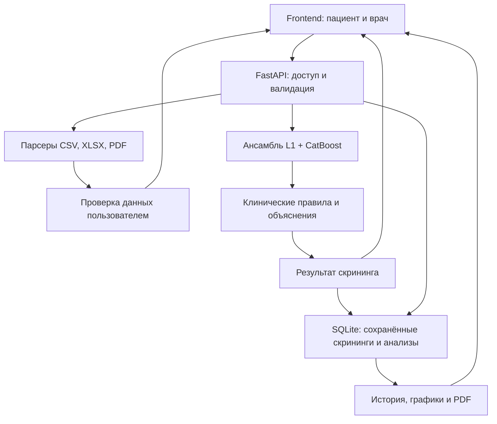

# Meditron

**Веб-сервис ИИ-скрининга латентных дефицитных состояний и анемий по лабораторным данным.**

Проект разработан для кейса Сеченовского университета в рамках хакатона. Meditron
объединяет машинное обучение и экспертные клинические правила: оценивает вероятности
дефицитных состояний, объясняет использованные критерии, показывает расхождения
между моделью и правилами и предлагает уточняющие исследования.

> Результат — предварительная скрининговая оценка, а не установленный диагноз.
> Прототип не заменяет консультацию врача и не предназначен для назначения лечения
> или самостоятельного принятия клинических решений.

Описание сверено с рабочей веткой `develop` на 5 октября 2026 года.
При переносе проекта в `main` README должен переноситься вместе с рабочим кодом.

## Возможности

**Для пациента:** регистрация и подтверждение почты, ручной ввод анализов,
импорт CSV/XLSX/PDF с текстовым слоем, скрининг, история результатов,
графики динамики лабораторных показателей с референсными границами и PDF-отчёт.

**Для врача:** загрузка CSV/XLSX с несколькими пациентами, предпросмотр и проверка
распознанных данных, пакетный скрининг, список пациентов, история и графики
каждого пациента, скачивание сохранённого результата в PDF.

**Для интеграции:** FastAPI, Swagger/OpenAPI, публичный скрининг без сохранения,
защищённые маршруты кабинетов, metadata модели и health check.

Импорт файла и скрининг — два отдельных действия: сначала пользователь проверяет
распознанные данные, затем подтверждает запуск анализа.

## Какие состояния оцениваются

| Ветка модели | Состояние |
| --- | --- |
| `iron_deficiency` | Дефицит железа |
| `B12_deficiency` | Дефицит витамина B12 |
| `folate_deficiency` | Дефицит фолатов |
| `B6_deficiency` | Дефицит витамина B6 |
| `copper_deficiency` | Дефицит меди |
| `inflammation_anemia` | Анемия воспаления |

Наличие анемии определяется отдельным детерминированным правилом по полу и
гемоглобину. Шесть бинарных прогнозов и это правило используются для сборки
итоговой категории: дефицит с анемией или без неё, смешанный дефицит,
анемия другой причины либо отсутствие выделенной моделью дефицитной гипотезы.
В текущем коде предусмотрены 12 итоговых категорий; их значения описаны
в [контракте API](docs/api_contract.md).

## Технологии и архитектура

| Часть | Реализация |
| --- | --- |
| Frontend | JavaScript, HTML/CSS, Vite; IBM Plex Sans и IBM Plex Mono |
| Backend | Python, FastAPI, Pydantic |
| База данных | SQLite, SQLAlchemy |
| ML inference | L1 Logistic Regression + CatBoost, Platt-калибровка, взвешенный ансамбль |
| Экспертный слой | Durable Rules, отдельная база клинических критериев |
| Импорт | pandas, openpyxl, pypdf |
| PDF | reportlab |
| Развёртывание | Docker Compose; Uvicorn для backend, Nginx для frontend |
| Проверки | pytest/httpx; Node.js и jsdom для frontend |



ML получает только числовые и демографические `features`. Единицы измерения и
референсные интервалы передаются отдельно в `lab_metadata`, сохраняются для графиков
и PDF и не изменяют модельные вероятности. Экспертный слой дополняет прогноз,
а не подменяет бинарные решения ансамбля.

## Структура репозитория

| Путь | Назначение |
| --- | --- |
| `api/main.py` | FastAPI-приложение, подключение маршрутов и CORS |
| `api/routes/` | Авторизация, скрининг, импорт, история, графики и врачебный кабинет |
| `api/schemas/` | Схемы запросов и ответов |
| `api/services/` | Логика обработки файлов, скрининга, хранения, почты и PDF |
| `api/database/` | SQLAlchemy-модели, соединение и создание таблиц |
| `api/security/` | Пароли и проверка сессий |
| `api/resources/` | Каталог лабораторных метаданных и группы показателей |
| `frontend/` | Веб-интерфейс, клиент API, тесты, Dockerfile и конфигурация Nginx |
| `ml/preprocessing/` | Проверка и подготовка frozen-контракта признаков |
| `ml/training/` | Модули обучения и оценки моделей |
| `ml/inference/` | Загрузка bundle, калибровка и ансамблевый inference |
| `expert/` | Клинические критерии, Durable Rules, evidence и рекомендации |
| `artifacts/inference_bundle/` | Готовые модели, калибраторы, веса, пороги и контракт признаков |
| `artifacts/ensemble/` | Сохранённые результаты внутренней OOF-оценки |
| `artifacts/external_validation/` | Отчёты проверки переноса на внешние данные |
| `artifacts/batch_validation/` | Отчёты пакетной проверки ML и экспертного слоя |
| `data/demo/` | Демонстрационные CSV и ожидаемые JSON-ответы |
| `data/raw/` | Исходные данные для исследовательской части |
| `data/external/` | Внешние данные исследовательской проверки |
| `notebooks/` | EDA, сравнение моделей, ансамбль, экспертный слой и внешняя проверка |
| `tests/` | Проверки backend, ML, правил, истории, импорта и каталога |
| `scripts/backfill_lab_metadata.py` | Заполнение метаданных старых сохранённых анализов |
| `docs/` | Контракт API, архитектура, Model Card и обзор рынка |
| `README_MIGRATION.md` | Перенос исследовательских модулей в production-структуру |
| `Dockerfile`, `docker-compose.yml` | Контейнеризация и запуск двух сервисов |
| `requirements.txt`, `requirements-production.txt` | Python-зависимости приложения и production ML/правил |

Для демонстрации используется уже готовый `artifacts/inference_bundle/`.
Обучать модели заново и запускать ноутбуки перед стартом сервиса не требуется.

## Быстрый старт через Docker

Команды ниже рассчитаны на Bash: Linux, macOS или WSL. Нужны Docker Engine/Desktop
и Docker Compose v2. Python и Node.js на хосте для контейнерного запуска не требуются.

### 1. Получить рабочий код

```bash
git clone --branch develop https://github.com/MaKudinets/Meditron_2026_Case_3.git
cd Meditron_2026_Case_3
cp .env.example .env
```

Пока рабочая реализация находится в `develop`, клонировать эту ветку.
После её слияния в `main` можно использовать обычный `git clone` без `--branch`.

### 2. Проверить обязательную зависимость экспертного слоя

**В проверенной версии Dockerfile устанавливает только `requirements.txt`,
а `durable_rules==2.0.28` перечислен в `requirements-production.txt`.**
Без этой библиотеки production-скрининг не выполняется. Для сборки её C-расширения
в образе `python:3.11-slim` нужен компилятор.

Перед первой сборкой убедиться, что корневой Dockerfile содержит следующую
установку зависимостей; если ещё нет — заменить его на этот вариант:

```dockerfile
FROM python:3.11-slim

WORKDIR /app
ENV PYTHONDONTWRITEBYTECODE=1
ENV PYTHONUNBUFFERED=1

RUN apt-get update \
    && apt-get install -y --no-install-recommends build-essential \
    && rm -rf /var/lib/apt/lists/*

COPY requirements.txt requirements-production.txt ./
RUN pip install --no-cache-dir --upgrade pip \
    && pip install --no-cache-dir -r requirements.txt -r requirements-production.txt

COPY . .
EXPOSE 8000
CMD ["uvicorn", "api.main:app", "--host", "0.0.0.0", "--port", "8000"]
```

Это необходимая подготовка текущей контейнерной конфигурации, а не уже выполненная
README-файлом модификация. `scikit-learn==1.7.2` закреплён в `requirements.txt`;
не заменять его произвольной версией при загрузке сериализованных моделей.

### 3. Собрать образ, создать таблицы и запустить сервисы

```bash
docker compose build
docker compose run --rm backend python -m api.database.init_db
docker compose up -d
```

Создание таблиц — отдельный обязательный шаг: в текущем FastAPI-приложении
автоматическая инициализация БД при старте не подключена. Команду `init_db` можно
повторять: существующие таблицы она не удаляет, но полноценной системой миграций
изменений схемы не является.

| Сервис | Адрес |
| --- | --- |
| Веб-интерфейс | http://localhost:3000 |
| Backend | http://localhost:8000 |
| Swagger | http://localhost:8000/docs |
| Health check | http://localhost:8000/health |

Compose использует SQLite в `/app/data_runtime/meditron.db` и volume `meditron_db`.
Отдельного сервиса PostgreSQL и порта 5432 нет.

### 4. Проверить запуск

```bash
docker compose ps
curl http://localhost:8000/health
docker compose logs --tail=100 backend
```

Готовый backend возвращает health с `status="ok"`, `ml_bundle_loaded=true`,
`expert_engine_available=true`. HTTP 200 с `status="degraded"` означает,
что API отвечает, но один из компонентов inference недоступен.

Остановка с сохранением БД:

```bash
docker compose down
```

Не добавлять `-v`, если нужно сохранить историю: этот флаг удаляет Compose volumes.

## Локальный запуск для разработки

Рекомендуемое окружение: Python 3.11, как в Dockerfile, и Node.js **22.12.0 или новее**,
как требует `frontend/package.json`. Два сервиса запускаются в отдельных терминалах.

### Backend

Для Linux/WSL при отсутствии компилятора:

```bash
sudo apt-get update
sudo apt-get install -y build-essential
```

В корне проекта:

```bash
python3.11 -m venv .venv
source .venv/bin/activate
python -m pip install --upgrade pip
python -m pip install -r requirements.txt -r requirements-production.txt
cp .env.example .env
mkdir -p data_runtime
```

Для Windows можно использовать `py -3.11 -m venv .venv` и
`.venv\Scripts\Activate.ps1`; при сложностях сборки Durable Rules использовать WSL
или Docker.

В локальном `.env` заменить Docker-путь БД на:

```dotenv
DATABASE_URL=sqlite:///./data_runtime/meditron.db
EMAIL_MODE=console
FRONTEND_URL=http://localhost:5173
```

Затем создать таблицы и запустить API. Инициализация явно загружает `.env`,
поскольку `api.database.init_db` сам его не читает:

```bash
python -c 'from dotenv import load_dotenv; load_dotenv(); from api.database.database import init_db; init_db()'
python -m uvicorn api.main:app --reload --host 127.0.0.1 --port 8000 --env-file .env
```

Не использовать `src.backend.main:app`: действующий путь приложения — `api.main:app`.
Без `DATABASE_URL` backend по умолчанию открывает `./meditron.db`; отдельный
`data_runtime` позволяет начать разработку с собственной БД.

### Frontend

Во втором терминале:

```bash
cd frontend
cp .env.example .env
npm ci
npm run dev
```

Открыть адрес, напечатанный Vite. Для live-режима в `frontend/.env`:

```dotenv
VITE_API_URL=http://127.0.0.1:8000
VITE_USE_MOCKS=false
VITE_REQUEST_FORMAT=features
```

Если `VITE_USE_MOCKS` не равно строке `false`, frontend включает demo-режим с
фикстурами. Для демонстрации работы настоящей модели нужен live-режим.

Проверить production-сборку:

```bash
npm run build
```

## Конфигурация

| Переменная | Назначение |
| --- | --- |
| `DATABASE_URL` | SQLAlchemy URL БД; в Compose — SQLite внутри volume |
| `EMAIL_MODE` | `console` для локальных ссылок подтверждения/сброса или `smtp` для отправки писем |
| `FRONTEND_URL` | Адрес frontend для ссылок в письмах; должен соответствовать способу запуска |
| `SMTP_HOST`, `SMTP_PORT` | Сервер отправки писем; порт по умолчанию 587 |
| `SMTP_USERNAME`, `SMTP_PASSWORD` | Учётные данные SMTP |
| `SMTP_FROM` | Адрес отправителя |
| `SMTP_SECURITY` | Режим SMTP; пример конфигурации использует `starttls` |
| `SESSION_TTL_HOURS` | Срок сессии; по умолчанию 168 часов |
| `PASSWORD_RESET_TTL_MINUTES` | Срок токена сброса; по умолчанию 30 минут |
| `MEDITRON_BUNDLE_DIR` | Необязательный путь к inference bundle; обычно используется bundle репозитория |
| `VITE_API_URL` | Базовый адрес API без `/api/v1` |
| `VITE_USE_MOCKS` | `false` для работы с backend |
| `VITE_REQUEST_FORMAT` | Текущее значение `features` |

Backend-переменные задаются в корневом `.env`, frontend-переменные — в
`frontend/.env` для Vite либо в build args Compose. `VITE_*` входят в клиентскую
сборку: не помещать туда секреты. После изменения build args пересобрать frontend.

В Compose адрес API сейчас `http://localhost:8000`. Для открытия сайта с другого
компьютера нужно задать доступный ему адрес backend и добавить origin сайта в CORS
`api/main.py`. Текущий CORS разрешает localhost/127.0.0.1 с портами 3000 и 5173.

## Демонстрация проекта

### Пациент

1. Зарегистрироваться с ролью пациента.
2. Подтвердить email. В режиме `EMAIL_MODE=console` ссылка выводится в логах
   backend; реальное письмо не отправляется.
3. Войти, открыть форму скрининга и загрузить `data/demo/patient_example.csv`.
4. Проверить распознанные значения, пол и гемоглобин; подтвердить запуск.
5. Показать итог, вероятности веток, уверенность, полноту данных и evidence.
6. Открыть историю, графики сохранённых показателей и скачать PDF.

### Врач

1. Зарегистрироваться с ролью врача, подтвердить email и войти.
2. Загрузить `data/demo/doctor_batch_example.csv`.
3. Проверить preview: коды пациентов, признаки, обязательные поля и предупреждения.
4. Подтвердить пакетный скрининг.
5. Показать результаты по строкам, список пациентов, историю выбранного пациента,
   динамику анализов и PDF.

Повторное сохранение анализов создаёт дополнительные точки графика. Для наглядной
динамики использовать несколько demo-наборов с разными значениями; даты точек
соответствуют времени сохранения скрининга, а не времени взятия анализа.

| Demo-файл | Назначение |
| --- | --- |
| `data/demo/patient_example.csv` | Один пациент с заполненным набором признаков |
| `data/demo/doctor_batch_example.csv` | Несколько пациентов для врачебной загрузки |
| `data/demo/expected/patient_example_result.json` | Пример полного ответа pipeline |
| `data/demo/expected/doctor_batch_result.json` | Сохранённый пример результатов пакетной проверки |
| `data/demo/README.md` | Описание demo-данных |

JSON в `expected/` — образцы результатов; динамические ID при новом запуске
могут отличаться. Формат ответа конкретного HTTP-маршрута проверяется по контракту
API, а не определяется названием demo-файла.

## Входные данные и API

Контракт модели содержит **37 признаков**: возраст и пол, ОАК, обмен железа,
витамины B12/B6 и фолаты, медь, маркеры воспаления, почечные и тиреоидные показатели,
альбумин и маркеры гемолиза.

- Обязательные поля: `sex` (`F` или `M`) и `hemoglobin`.
- Необязательные числовые поля можно пропустить или передать `null`.
- Лабораторные числа — неотрицательные; возраст — от 0 до 120.
- Регистр ключей значим: `MCV`, `TIBC`, `TSAT`, `vitamin_B12`, `CRP`.
- Единицы должны соответствовать шкалам модели: автоматической конвертации по
  строке `unit` в текущем pipeline нет.
- Низкая полнота сейчас не блокирует API автоматически: результат содержит
  `data_quality.coverage`, отсутствующие признаки и предупреждения.

| Импорт | Форматы | Лимит |
| --- | --- | --- |
| Пациент | CSV, XLSX, PDF с текстовым слоем | 5 MiB |
| Врач | CSV, XLSX; одна строка — один пациент | 10 MiB |
| Подтверждённый bulk-запрос | JSON после проверки preview | 1–200 пациентов |

OCR фотографий и сканов, JPG/PNG, DICOM/MIC и текстовые анкеты в текущем API
не реализованы. PDF-парсер извлекает числовые данные из текста, а не передаёт
изображение модели. Текущий сервис нельзя описывать как реализованную модель
«лабораторные показатели + изображения».

### Основные маршруты

| Метод и путь | Назначение | Доступ |
| --- | --- | --- |
| `GET /health` | Состояние API, bundle и expert engine | Публичный |
| `GET /api/v1/meta/features` | Frozen-контракт признаков | Публичный |
| `GET /api/v1/meta/model` | Версия и архитектура bundle | Публичный |
| `POST /api/v1/auth/register`, `/login` | Регистрация и вход | Публичный |
| `GET /api/v1/auth/me` | Текущий пользователь | Bearer |
| `POST /api/v1/screenings` | Скрининг без сохранения | Публичный |
| `POST /api/v1/me/imports/lab-file` | Preview файла пациента | Пациент |
| `POST /api/v1/me/screenings` | Скрининг с сохранением | Пациент |
| `GET /api/v1/me/screenings` | История | Пациент |
| `GET /api/v1/me/trends` | Группы лабораторных графиков | Пациент |
| `GET /api/v1/me/screenings/{screening_id}/report.pdf` | Отчёт | Пациент |
| `POST /api/v1/doctor/imports/lab-file` | Preview нескольких пациентов | Врач |
| `POST /api/v1/doctor/screenings/bulk` | Пакетный скрининг | Врач |
| `GET /api/v1/doctor/patients` | Пациенты текущего врача | Врач |

В таблице перечислены основные группы. Все 27 маршрутов, включая подтверждение
email, восстановление пароля, удаление истории и врачебные отчёты,
описаны в [docs/api_contract.md](docs/api_contract.md).

### Проверка inference без регистрации

```bash
curl -X POST http://localhost:8000/api/v1/screenings \
  -H 'Content-Type: application/json' \
  -d '{"patient_id":"DEMO-P001","features":{"age_years":34,"sex":"F","hemoglobin":108,"MCV":78.5,"MCH":25.4,"ferritin":7.2,"serum_iron":7.8,"TIBC":82,"TSAT":9.5}}'
```

Пример намеренно содержит только часть признаков; ответ может включать
предупреждение о низкой полноте. Этот запрос не создаёт историю и не позволяет
скачать PDF по возвращённому ID через защищённый маршрут.

### Что возвращает скрининг

| Поле | Содержание |
| --- | --- |
| `screening_id`, `patient_id` | Идентификаторы результата и пациента |
| `prediction` | Флаг анемии, `anemia_class`, `deficiency_cause` |
| `deficiencies` | Шесть веток: probability, prediction, threshold, rule_score, rule_state, confidence |
| `confidence` | Уверенность в выбранном результате; не уровень риска заболевания |
| `data_quality` | Полнота, использованные/пропущенные признаки, warnings |
| `evidence` | Признаки экспертного слоя, критерии и ссылки на источники |
| `conflicts` | Расхождения ML и правил |
| `recommended_next_tests` | Уточняющие исследования и причины рекомендации |
| `model` | Имя и версия bundle |
| `disclaimer` | Ограничения интерпретации |

Frontend использует готовый `prediction` каждой ветки: нельзя заменять серверные
пороги своими границами «низкого/среднего/высокого риска». Поле `risk_level`
в текущей схеме отсутствует. Полный JSON-пример —
[data/demo/expected/patient_example_result.json](data/demo/expected/patient_example_result.json).

Авторизация — `Authorization: Bearer <access_token>`. Токен непрозрачный,
не JWT; сервер проверяет сессию в БД. Без подтверждённого email вход недоступен.

## Модель, объяснимость и качество

Для каждой из шести веток используются L1 Logistic Regression и CatBoost.
Вероятности калибруются методом Platt и объединяются с frozen-весами;
порог решения каждой ветки сохранён в inference bundle. Экспертный слой отдельно
проверяет клинические критерии и формирует evidence, конфликты и рекомендации.
В API объяснимость представлена критериями экспертной системы; SHAP-ответ
текущей схемой не предусмотрен.

В `manifest.json` указан внутренний набор из **840 пациентов**.
Сохранённые внутренние OOF-результаты из `artifacts/ensemble/model_comparison.csv`:

| Модель | Macro F1 | Balanced accuracy | Accuracy |
| --- | --- | --- | --- |
| Калиброванный взвешенный ансамбль | 0.8997 | 0.8860 | 0.9048 |
| Иерархический CatBoost | 0.8925 | 0.8750 | 0.8976 |
| Иерархическая L1 Logistic Regression | 0.8702 | 0.8643 | 0.8726 |

Это сохранённые исследовательские показатели, а не результаты нового запуска
тестов и не доказательство клинической точности. Полные обученные deployment-модели
не использовать для оценки на тех же данных: внутреннее качество следует
сообщать по OOF-расчётам. Редкие ветки B6 и меди содержат по 35 положительных
примеров, поэтому общий Macro F1 не заменяет оценку каждой ветки.

В репозитории есть исследовательская проверка frozen-pipeline на NHANES:
покрытие признаков, пропуски, сдвиг распределений и согласованность моделей.
Сопоставимых меток для всех шести целей и 12 итоговых классов в этой проверке нет;
внешние Macro F1/accuracy для всех состояний не заявляются.
Границы этих выводов зафиксированы в
[external_validation_claims.csv](artifacts/external_validation/external_validation_claims.csv).

Подробнее: [Model Card](docs/model_card.md),
[инструкции по production-модулям](README_MIGRATION.md), исследовательские ноутбуки.

## Тесты и проверка перед демонстрацией

Backend — из корня проекта в окружении с установленными зависимостями:

```bash
python -m pytest -q tests
```

Для отдельных сценариев:

```bash
python -m pytest -q tests/test_api.py tests/test_auth.py tests/test_history.py
python -m pytest -q tests/test_file_import.py tests/test_lab_metadata_catalog.py
python -m pytest -q tests/test_preprocessing.py tests/test_rules.py tests/test_durable_engine.py
```

Frontend:

```bash
cd frontend
npm ci
npm test
npm run build
```

Для Docker backend:

```bash
docker compose run --rm backend python -m pytest -q tests
```

Тесты Durable Rules могут пропускаться при отсутствии зависимости, но для
демонстрации полного pipeline она обязательна. Не считать запуск без экспертного
слоя полноценной проверкой готовности.

Перед показом проверить live-режим, health, подтверждение email и вход для двух
ролей, импорт → подтверждение, сохранение истории, врачебный bulk, графики и PDF.
При timeout сохранённого POST сначала проверить историю: автоматической
идемпотентности сейчас нет, повтор может создать второй скрининг.

## Безопасность и ограничения

В текущем коде реализованы хеширование паролей Argon2, хранение хешей токенов,
проверка срока и отзыва сессии, разграничение ролей, проверка принадлежности истории
пациенту и связи пациента с врачом. Загруженные файлы разбираются из содержимого
запроса, а анализы и результаты сохраняются в SQLite для истории.

Перед внешним развёртыванием требуется отдельно настроить HTTPS, SMTP, разрешённые
origins, защиту и резервное копирование БД. Текущий Compose публикует локальные
HTTP-порты; TLS, аудит всех действий и rate limiting в этой конфигурации
не предоставляются. Выбор роли `doctor` при регистрации не проверяет
профессиональный статус пользователя.

Не добавлять в Git реальные медицинские документы, данные пациентов, рабочую БД,
пароли и `.env`. В режиме console ссылки подтверждения/сброса содержат токены:
не публиковать такие логи. `.gitignore` защищает от случайного добавления новых
файлов, но не удаляет ранее закоммиченные данные; уже отслеживаемые БД и датасеты
следует проверить перед передачей репозитория.

Пропущенный анализ не считается нормальным. Каталожные референсы — fallback
проекта, а не универсальные индивидуальные нормы; приоритет имеют корректные
метаданные конкретной лаборатории. Между результатами возможны отличия единиц
и интервалов; их нельзя автоматически считать сопоставимыми.

Клиническая валидация и применение на пациентах находятся за пределами
демонстрационного прототипа. Реализованный интерфейс, тесты и внутренняя оценка
модели не заменяют независимую клиническую проверку.

## Документация

| Документ | Содержание |
| --- | --- |
| [API Contract](docs/api_contract.md) | Полные маршруты, payload, ответы, права, ошибки, импорт, графики и PDF |
| [Архитектура](docs/architecture.md) | Устройство системы |
| [Model Card](docs/model_card.md) | Назначение, признаки, модели, оценка качества и ограничения |
| [Рынок](docs/market.md) | Исследование продукта и рынка |
| [Production-модули](README_MIGRATION.md) | Frozen bundle, Durable Rules и перенос из ноутбуков |
| [Frontend README](frontend/README.md) | Веб-интерфейс и локальная разработка |
| [Frontend integration](frontend/INTEGRATION.md) | Дополнительные заметки по интеграции |
| [Demo README](data/demo/README.md) | Демонстрационные файлы |

Описание фактического API определяется кодом маршрутов, Pydantic-схемами и
`docs/api_contract.md`. При изменении форматов синхронно обновлять backend,
frontend и документацию.

## Команда

| Участник | Зона ответственности |
| --- | --- |
| Максим | Team Lead, backend, API, интеграция и демонстрация |
| Таня В | Data Science, подготовка данных, оценка качества и метрики |
| Таня Б | ML engineering, модели, экспертные правила и inference |
| Даша | Frontend, дизайн, UI/UX и демонстрация интерфейса |
| Лера | Продукт, документация, рынок и презентация |

## Статус и дальнейшее развитие

Проект — хакатонный прототип с готовым inference bundle и сценариями пациента и
врача. Следующие этапы: независимая клиническая валидация, контроль шкал и единиц,
усиление безопасности внешнего развёртывания, миграции БД и расширение API
клинической интерпретации. OCR и дополнительная модальность требуют отдельной
реализации и проверки вклада в качество.

В проверенном репозитории отдельный файл `LICENSE` отсутствует. Условия
распространения кода, моделей и исходных данных следует определить явно;
публичность репозитория сама по себе не задаёт лицензию.
