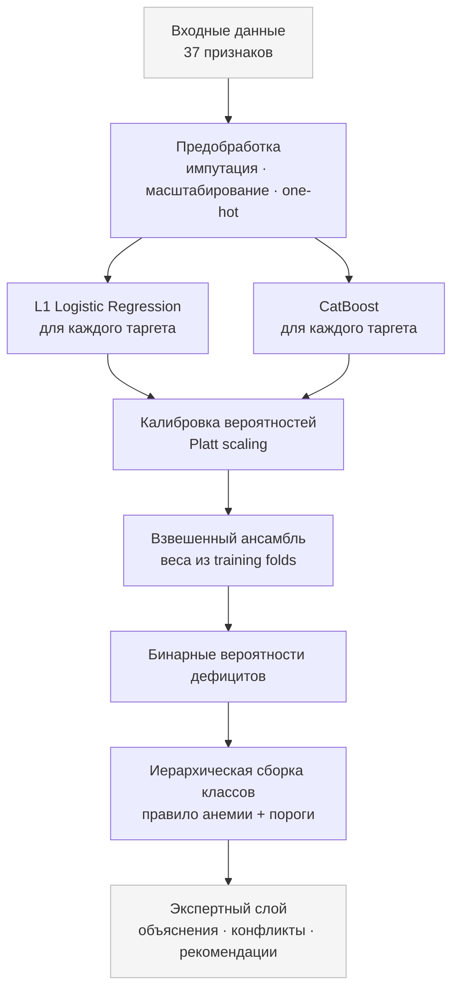

# Model Card: Meditron – Система скрининга дефицитных состояний и анемии

**Версия:** 0.1.0  
**Дата:** 2026-10-05 
**Тип модели:** Иерархический ансамбль (L1 + CatBoost) с калибровкой вероятностей и экспертным слоем на основе клинических правил.

---

## 1. Обзор модели

Meditron — это система поддержки принятия врачебных решений, предназначенная для скрининга латентных дефицитных состояний (железо, B12, фолаты, B6, медь) и анемии, а также для определения вероятной причины анемии.

Модель не ставит окончательный диагноз, а выдаёт вероятности наличия дефицитов, итоговый класс анемии и рекомендации по дополнительным исследованиям. Окончательное решение остаётся за врачом.

**Основные выходы:**
- Вероятности шести бинарных состояний: `iron_deficiency`, `B12_deficiency`, `folate_deficiency`, `B6_deficiency`, `copper_deficiency`, `inflammation_anemia`.
- Итоговый класс `anemia_class` (12 возможных значений, например, `iron_deficiency_anemia`, `mixed_deficiency`, `no_anemia_no_deficiency`).
- Причина дефицита `deficiency_cause` (например, `iron_deficiency`, `B12_folate`).
- Оценка уверенности (confidence), качество данных (coverage), список использованных и пропущенных признаков, предупреждения.
- Объяснения (evidence), конфликты между ML и правилами, рекомендованные следующие анализы.

---

## 2. Назначение и использование

### 2.1. Целевая аудитория
- Врачи (терапевты, гематологи) — для предварительной оценки и поддержки решений.
- Пациенты — для самостоятельного скрининга (с обязательной последующей консультацией врача).
- Разработчики — для интеграции в медицинские информационные системы через REST API.

### 2.2. Основные сценарии
- Загрузка лабораторных данных вручную или из файла (CSV/XLSX).
- Пакетная обработка списка пациентов (для врачей).
- Получение PDF-отчёта с результатами.
- Просмотр истории скринингов и трендов.

### 2.3. Ограничения по использованию
- **Не является медицинским изделием.** Результаты носят информационный характер и не заменяют профессиональную диагностику.
- Не предназначена для экстренных состояний.
- Требуется валидация на местной популяции перед клиническим применением.

---

## 3. Данные

### 3.1. Обучающая выборка
- **Источник:** `deficiency_anemia.csv` (внутренний датасет).
- **Объём:** 840 пациентов, 48 столбцов.
- **Входные признаки (37):** демография (`age_years`, `sex`), общий анализ крови (`hemoglobin`, `RBC`, `MCV`, `MCH`, `MCHC`, `RDW`, `platelets`, `WBC`, `reticulocytes`), обмен железа (`ferritin`, `serum_iron`, `transferrin`, `TIBC`, `UIBC`, `TSAT`, `sTfR`, `Ret_He`), витамины (`vitamin_B12`, `active_B12`, `MMA`, `homocysteine`, `folate`, `vitamin_B6`), медь (`copper`, `ceruloplasmin`), воспаление (`CRP`, `ESR`, `albumin`), почки/щитовидная железа (`creatinine`, `eGFR`, `TSH`), гемолиз (`LDH`, `indirect_bilirubin`, `haptoglobin`).
- **Целевые переменные:** бинарные флаги дефицитов, `anemia`, `mixed_deficiency`, `anemia_class`, `deficiency_cause`.
- **Пропуски:** присутствуют, медианная импутация для числовых, наиболее частые для категориальных.
- **Дисбаланс классов:** выраженный (например, `B6_deficiency` и `copper_deficiency` по 35 примеров, `iron_deficiency` — 290).

### 3.2. Внешняя валидация
- **Источник:** NHANES 2021–2023 (США).
- **Цель:** проверка переносимости и устойчивости модели на внешней популяции.
- **Артефакты:** `nhames_external_feature_matrix.csv`, `nhames_frozen_predictions.csv`, отчёты в `artifacts/external_validation/`.

---

## 4. Архитектура модели

### 4.1. Общая схема
# Архитектура ML-пайплайна **Meditron**

> Многоуровневый ансамблевый пайплайн для прогнозирования дефицитов и сборки клинических классов

---

## Общая схема пайплайна

# Meditron · ML-пайплайн


### 4.2. Компоненты
- **Предобработка:** `SimpleImputer(median)` + `StandardScaler` для числовых, `SimpleImputer(most_frequent)` + `OneHotEncoder` для категориальных.
- **Бинарные модели:** для каждого из 6 таргетов обучаются отдельно L1-логистическая регрессия (с балансировкой классов) и CatBoost (фиксированные гиперпараметры).
- **Калибровка:** для каждой модели применяется Platt scaling (логистическая регрессия на логитах) для получения откалиброванных вероятностей.
- **Ансамбль:** взвешенная сумма калиброванных вероятностей L1 и CatBoost. Веса подбираются на тренировочных фолдах (медиана по фолдам).
- **Пороги:** для перевода вероятностей в бинарные предсказания используются пороги, также подобранные на тренировочных фолдах (медиана).
- **Правило анемии:** детерминированное: `Hb < 120` для женщин, `Hb < 130` для мужчин.
- **Экспертный слой:** клинические правила (на основе рекомендаций Минздрава РФ) формируют объяснения, выявляют конфликты и рекомендуют дополнительные анализы. В продакшене `rule_weight = 0`, т.е. правила не влияют на вероятность, но используются для интерпретации.

### 4.3. Инференс
- Загрузка `inference_bundle` из `artifacts/inference_bundle/` (содержит `feature_contract.json`, `manifest.json`, `ensemble_meta_settings.csv`, модели и калибраторы).
- Функция `predict_one(data)` возвращает словарь с предсказаниями, вероятностями, покрытием, предупреждениями.
- Экспертный слой (`expert/engine.py`) добавляет `evidence`, `conflicts`, `recommended_next_tests`.

---

## 5. Обучение

### 5.1. Валидация
- **Стратегия:** 5-фолдовая стратифицированная кросс-валидация (`StratifiedKFold`).
- **Оценка:** out-of-fold (OOF) предсказания — каждый пациент предсказывается моделью, не обученной на нём.
- **Исключение утечек:** все этапы (импутация, масштабирование, отбор признаков, подбор гиперпараметров, калибровка, веса, пороги) выполняются только на тренировочной части фолда.

### 5.2. Гиперпараметры
- **L1:** параметр `C` подбирается внутренней 3-фолдовой CV на тренировочной части.
- **CatBoost:** фиксированные параметры: `iterations=300`, `depth=5`, `learning_rate=0.05`, `l2_leaf_reg=5.0`, `auto_class_weights='Balanced'`.

### 5.3. Веса ансамбля и пороги
- Для каждого таргета на каждом тренировочном фолде подбираются веса L1 и CatBoost, а также порог классификации.
- Итоговые значения — медиана по 5 фолдам.

---

## 6. Оценка

### 6.1. Метрики
- Для бинарных дефицитов: F1, Precision, Recall, Balanced Accuracy, PR-AUC, ROC-AUC, Brier score.
- Для многоклассовой классификации: Macro F1, Balanced Accuracy, Accuracy.
- Для причины дефицита: Macro F1, Accuracy.

### 6.2. Результаты OOF (иерархическая модель)

| Модель               | Macro F1 | Balanced Accuracy | Accuracy |
|----------------------|----------|-------------------|----------|
| hierarchical_L1      | 0.8702   | 0.8643            | 0.8726   |
| hierarchical_CatBoost| 0.8925   | 0.8750            | 0.8976   |

**Причина дефицита (`deficiency_cause`):**

| Модель               | Macro F1 | Accuracy |
|----------------------|----------|----------|
| hierarchical_L1      | 0.8526   | 0.8714   |
| hierarchical_CatBoost| 0.8763   | 0.8964   |

### 6.3. Бинарные метрики (OOF, CatBoost)

| Таргет                | F1     | Precision | Recall | PR-AUC | ROC-AUC | Brier  |
|-----------------------|--------|-----------|--------|--------|---------|--------|
| iron_deficiency       | 0.9913 | 1.0000    | 0.9828 | 0.9983 | 0.9990  | 0.0074 |
| B12_deficiency        | 0.9653 | 0.9784    | 0.9526 | 0.9930 | 0.9976  | 0.0117 |
| folate_deficiency     | 0.8094 | 0.8403    | 0.7806 | 0.9024 | 0.9661  | 0.0507 |
| B6_deficiency         | 0.8615 | 0.9333    | 0.8000 | 0.8787 | 0.9802  | 0.0107 |
| copper_deficiency     | 0.8955 | 0.9375    | 0.8571 | 0.9487 | 0.9957  | 0.0071 |
| inflammation_anemia   | 0.9612 | 0.9688    | 0.9538 | 0.9938 | 0.9994  | 0.0043 |

*Примечание: полные таблицы доступны в `artifacts/hierarchical/binary_target_metrics.csv`.*

### 6.4. Анализ ошибок
- **Confusion matrix** для иерархической модели показывает, что основные ошибки возникают между близкими классами (например, `latent_deficiency` и `iron_deficiency_anemia`, `B12_deficiency_anemia` и `B12_deficiency_no_anemia`).
- **Смешанные дефициты** (`mixed_deficiency`) предсказываются с F1 ≈ 0.85.
- **Редкие классы** (`B6_deficiency`, `copper_deficiency`) имеют более низкий recall, что связано с малым числом примеров.

---

## 7. Ограничения и рекомендации

### 7.1. Ограничения
- **Малая выборка:** 840 пациентов, что ограничивает обобщающую способность.
- **Дисбаланс классов:** некоторые дефициты представлены менее 40 примерами.
- **Пропуски:** до 85% пропусков для некоторых признаков (например, `copper`, `ceruloplasmin`), что может влиять на стабильность.
- **Отсутствие проспективной валидации:** модель проверена ретроспективно на OOF и внешнем NHANES.
- **Зависимость от качества лабораторных данных:** требуется стандартизация единиц и методов.
- **Не является медицинским изделием:** не сертифицирована как средство диагностики.

### 7.2. Рекомендации
- Использовать только как вспомогательный инструмент.
- Всегда интерпретировать результаты в контексте клинической картины.
- Проводить локальную валидацию перед внедрением.
- При низком покрытии (<70%) результаты считать ненадёжными.
- Регулярно переобучать модель на новых данных.

---

## 8. Этические аспекты

- **Конфиденциальность:** все данные пациентов должны быть обезличены. API использует `patient_code` и `external_code`.
- **Прозрачность:** экспертный слой предоставляет объяснения (evidence) и указывает на конфликты.
- **Ответственность:** окончательное решение принимает врач. Система не несёт ответственности за диагностические ошибки.
- **Справедливость:** необходима проверка на демографических подгруппах (возраст, пол, этническая принадлежность).

---

## 9. Как использовать модель

### 9.1. Загрузка бандла
```python
from ml.inference import load_inference_bundle, predict_one

bundle = load_inference_bundle("artifacts/inference_bundle")
result = predict_one({
    "age_years": 45,
    "sex": "F",
    "hemoglobin": 110,
    "ferritin": 15,
    # ... остальные признаки
})

## 9.2. Интерпретация результата

- **`prediction`** — итоговый класс и причина.
- **`deficiencies`** — вероятности по каждому дефициту.
- **`coverage`** — доля заполненных признаков.
- **`warnings`** — предупреждения о данных.
- **`evidence`** — клинические признаки, подтверждающие/опровергающие дефицит.
- **`recommended_next_tests`** — рекомендуемые дополнительные анализы.

## 9.3. Интеграция

- REST API (FastAPI) с эндпоинтами:
  - `/api/v1/screenings`
  - `/api/v1/me/screenings`
  - `/api/v1/doctor/patients`
  - и др.
- Фронтенд (React) для врачей и пациентов.
- PDF-генерация отчётов.
